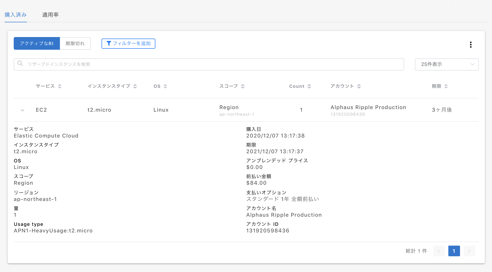

# リザーブドインスタンス

購入したリザーブドインスタンスの管理ページです。


プランによってはリザーブドインスタンスページは表示されません。


## 1. 購入済み 

購入済みのリザーブドインスタンスの一覧を確認できます。

1行ごとに購入したRIの種類が表示され、ドロップダウンから詳細が確認できます。

ページ上部のアクティブな RI では有効期間内のリザーブドインスタンスが表示され、期限切れのタブにて過去のリザーブドインスタンスが確認できます。

選択した月の１ヶ月の適用状況が表示されます。

* **サービス**：EC2、RDSなどRIを所有しているサービスが表示されます。
* **タイプ**：インスタンスタイプが表示されます。`Size Flexible`の記載があるものはRIの柔軟性があるものです。
* **OS**：該当するプラットドームを表示しています。
* **アベイラビリティ**ーゾーン：実際にインスタンスが稼働したAZが記載されます。
* **総稼働時間**：該当のインスタンスがオンデマンド、RIが適用された稼働の合計時間が表示されます。
* **適用率**：総稼働時間に対して、RIが適用された割合を表示しています。
* **アカウント名**：インスタンスに該当するアカウント名。
* **アカウントID**：インスタンスに該当するアカウントID。

ドロップダウンで詳細が表示されます。

* **Normalization factor**：正規化係数
* **Normalized usage quantity**：正規化された利用量
* **Normalized covered quantity**：正規化された適用時間

フィルターで絞り込みが可能です。

## 3. レコメンド 

適用状況を元に、リザーブドインスタンスの最大の購入可能台数を表示しています。

**①** 今現在オンデマンドで課金されているインスタンスの合計料金  
**②** 「レコメンド」ページの RIを全て購入し、100%適用された場合の削減後のコスト  
**③** 「レコメンド」ページの RIを全て購入し、100%適用された場合の削減コスト  
**④** ③の内容で1年間削減された場合の想定削減額

支払いオプションで「全額前払い」「一部前払い」「前払いなし」を選択するとその支払い形態ごとの削減コストのシミュレーションが表示されます。

各行のドロップダウンから詳細の閲覧が可能です。

