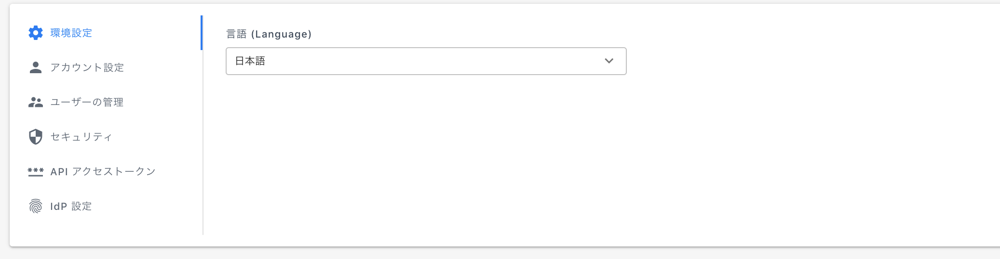

# Savings Plans

購入した Savings Plans の管理ページです。


プランによっては Savings Plans ページは表示されません。


1行ごとにコミットした Savings Plans が表示され、ドロップダウンから詳細が確認できます。

ページ上部のアクティブな SP では有効期間内の Savings Plans が表示され、期限切れのタブにて過去の Savings Plans が確認できます。

* **タイプ:** EC2 Instance, Compute, AWS SageMaker
* **サービス**：EC2、RDSなどSPsの適用対象サービスが表示されます。
* **インスタンスファミリー**：EC2 Instance Savings Plans の場合は購入したインスタンスファミリーが表示されます。
* **コミットメント; :：時間あたりのコミット金額**
* **リージョン**：実際にインスタンスが稼働したAZが記載されます。
* **量**：購入した数量が記載されます。
* Usage type**Usage type**：
* **購入日**：該当のRIを購入した日時が記載されます（UTCベース）
* **期限：**RIの期限が記載されます（UTCベース）
* **アンブレンデッドプライス**：月額の課金額（前払いなし、一部前払い時のみ費用発生）
* **前払い金額**：購入時に前払いした金額。
* **支払いオプション**：スタンダード・コンバーチブル、期間（１年・3年）、購入方法（全額前払い・一部前払い・前払いなし）
* **アカウント名**：RIを購入したアカウント名。
* **アカウントID**：RIを購入したアカウントID。

フィルターで絞り込みが可能です。

## 3. レコメンド 

適用状況を元に、リザーブドインスタンスの最大の購入可能台数を表示しています。

**①** 今現在オンデマンドで課金されているインスタンスの合計料金  
**②** 「レコメンド」ページの RIを全て購入し、100%適用された場合の削減後のコスト  
**③** 「レコメンド」ページの RIを全て購入し、100%適用された場合の削減コスト  
**④** ③の内容で1年間削減された場合の想定削減額

支払いオプションで「全額前払い」「一部前払い」「前払いなし」を選択するとその支払い形態ごとの削減コストのシミュレーションが表示されます。

各行のドロップダウンから詳細の閲覧が可能です。

