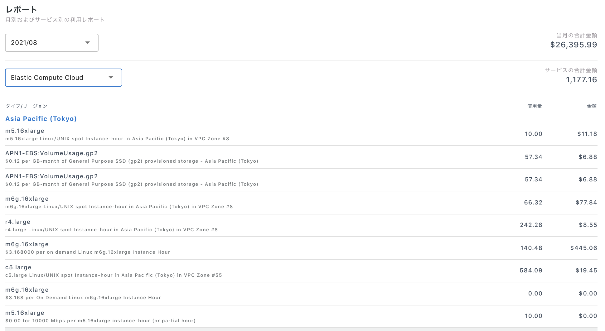

# レポート

レポートでは、AWSの各サービスの利用状況を細かい粒度で確認できます。


日次データ（デイリー）について

更新タイミング：毎日  
データ鮮度：約2日前のデータ  
グラフに含まれない内容：即時課金の費用、サポート費用、RI/SPs購入費用、返金、クレジット  
即時課金費用の例：RI/SPsの前払金、 Marketplaceの前払金、ドメインの購入費用など



月次データ（マンスリー）について

更新タイミング：月次  
データ内容：当月1日〜約2日前までのデータの累積  
\* 最終的に先月分の月次データ金額が確定するのは毎月5日前後です。  
グラフに含まれない内容：即時課金の費用、サポート費用、返金、クレジット


アカウント、グループ、タグ、の3つの単位からデータを閲覧できます。  
それぞれの特徴は以下の通りです。

<table>
  <thead>
    <tr>
      <th style="text-align:left"></th>
      <th style="text-align:left">&#x8AAC;&#x660E;</th>
    </tr>
  </thead>
  <tbody>
    <tr>
      <td style="text-align:left">&#x30A2;&#x30AB;&#x30A6;&#x30F3;&#x30C8;</td>
      <td style="text-align:left">
        
&#x30A2;&#x30AB;&#x30A6;&#x30F3;&#x30C8;&#x3054;&#x3068;&#x306E;&#x8A73;&#x7D30;&#x306A;&#x5229;&#x7528;&#x91D1;&#x984D;&#x3092;&#x628A;&#x63E1;&#x3067;&#x304D;&#x307E;&#x3059;&#x3002;
           &#x53F3;&#x4E0A;&#x306E;&#x30C9;&#x30ED;&#x30C3;&#x30D7;&#x30C0;&#x30A6;&#x30F3;&#x3088;&#x308A;&#x4EE5;&#x4E0B;&#x306E;&#x5185;&#x5BB9;&#x304C;&#x78BA;&#x8A8D;&#x3067;&#x304D;&#x307E;&#x3059;&#x3002;

        <ol>
          <li>&#x30A2;&#x30AB;&#x30A6;&#x30F3;&#x30C8;&#x60C5;&#x5831;&#x306E;&#x5909;&#x66F4;
            - &#x8868;&#x793A;&#x3055;&#x308C;&#x3066;&#x3044;&#x308B;&#x30A2;&#x30AB;&#x30A6;&#x30F3;&#x30C8;&#x540D;&#x304C;&#x5909;&#x66F4;&#x3067;&#x304D;&#x307E;&#x3059;&#x3002;</li>
          <li><a href="https://docs.alphaus.cloud/v/wave/alphaus-wave-aws/aws-detail/budget">&#x4E88;&#x7B97;&#x8A2D;&#x5B9A;</a> -
            &#x65E5;&#x5225;&#x3001;&#x6708;&#x5225;&#x3067;&#x306E;&#x4E88;&#x7B97;&#x3068;&#x901A;&#x77E5;&#x306E;&#x8A2D;&#x5B9A;&#x304C;&#x3067;&#x304D;&#x307E;&#x3059;&#x3002;</li>
          <li><a href="https://docs.alphaus.cloud/v/wave/alphaus-wave-aws/aws-detail/fee">&#x305D;&#x306E;&#x4ED6;&#x306E;&#x660E;&#x7D30;&#x60C5;&#x5831;</a> -
            &#x5F93;&#x91CF;&#x8AB2;&#x91D1;&#x4EE5;&#x5916;&#x306E;&#x5229;&#x7528;&#x6599;&#xFF08;Fee/Credit/Refund/Other
            fee)&#x304C;&#x78BA;&#x8A8D;&#x3067;&#x304D;&#x307E;&#x3059;</li>
        </ol>
      </td>
    </tr>
    <tr>
      <td style="text-align:left">&#x30B0;&#x30EB;&#x30FC;&#x30D7;</td>
      <td style="text-align:left">&#x8907;&#x6570;&#x306E;&#x30A2;&#x30AB;&#x30A6;&#x30F3;&#x30C8;&#x3092;&#x30B0;&#x30EB;&#x30FC;&#x30D4;&#x30F3;&#x30B0;&#x3059;&#x308B;&#x3053;&#x3068;&#x3067;&#x3001;&#x4EFB;&#x610F;&#x306E;&#x307E;&#x3068;&#x307E;&#x308A;&#x3067;&#x306E;&#x5229;&#x7528;&#x91D1;&#x984D;&#x3092;&#x628A;&#x63E1;&#x3067;&#x304D;&#x307E;&#x3059;&#x3002;
         &#x307E;&#x305A;&#x306F;<code>&#x30B0;&#x30EB;&#x30FC;&#x30D7; &#x306E;&#x4F5C;&#x6210;</code>&#x304B;&#x3089;&#x3001;&#x30B0;&#x30EB;&#x30FC;&#x30D7;&#x3092;&#x4F5C;&#x6210;&#x3057;&#x307E;&#x3057;&#x3087;&#x3046;&#x3002;</td>
    </tr>
    <tr>
      <td style="text-align:left">&#x30BF;&#x30B0;</td>
      <td style="text-align:left">&#x30BF;&#x30B0;&#x3068;&#x306F;&#x3001;AWS&#x306E;&#x5404;&#x30EA;&#x30BD;&#x30FC;&#x30B9;&#x306B;Key&#x3001;Value&#x306E;&#x5F62;&#x5F0F;&#x3067;&#x4ED8;&#x4E0E;&#x3059;&#x308B;&#x3053;&#x3068;&#x304C;&#x3067;&#x304D;&#x308B;&#x30E9;&#x30D9;&#x30EB;&#x3067;&#x3059;&#x3002;
         AWS&#x3067;&#x5229;&#x7528;&#x3055;&#x308C;&#x3066;&#x3044;&#x308B;&#x30BF;&#x30B0;&#x3054;&#x3068;&#x306E;&#x8A73;&#x7D30;&#x306A;&#x5229;&#x7528;&#x91D1;&#x984D;&#x3092;&#x628A;&#x63E1;&#x3067;&#x304D;&#x307E;&#x3059;&#x3002;&#x30BF;&#x30B0;&#x6A5F;&#x80FD;&#x306E;&#x8A2D;&#x5B9A;&#x65B9;&#x6CD5;&#x306F;&#x3001;
        <a
        href="https://docs.alphaus.cloud/v/wave/alphaus-wave-aws/aws-detail/tag">&#x30BF;&#x30B0;&#x6A5F;&#x80FD;&#x306E;&#x6709;&#x52B9;&#x5316;</a>&#x3092;&#x3054;&#x89A7;&#x304F;&#x3060;&#x3055;&#x3044;&#x3002;</td>
    </tr>
  </tbody>
</table>

### グラフ

Waveのグラフは、AWSのサービスごとに使用状況を可視化します。

サービス単位ではなく、全サービスの合計を見たい場合は`トータル表示`のチェックボックスにチェックを入れてください。

フィルターを活用すれば、自分が見たいデータだけをグラフに表示できます。デフォルトでは、利用されている上位10個が選択されている状態です。

### 月ごとのプロダクト単位の利用レポート

グラフの下には、プロダクト別の詳細な利用レポートが表示されます。  
利用レポートは月別、サービス別に確認できます。確認したい年月とAWSのサービスを選ぶことで、該当する明細が表示されます。‌

CSVデータが用意されている場合はレポート右上のダウンロードボタンからCSVデータとして出力できます。CSVファイルには、選択した月の全サービスの利用データが含まれます。

CSV形式でのダウンロードはアカウントとタグで利用することが可能です。\*グループ機能ではデータのダウンロードはできません。

UIのレポートとCSVデータの照らし合わせについては、[レポートとCSV](https://docs.alphaus.cloud/v/wave/alphaus-wave-aws/aws-detail/reportcsv)をご覧ください。

