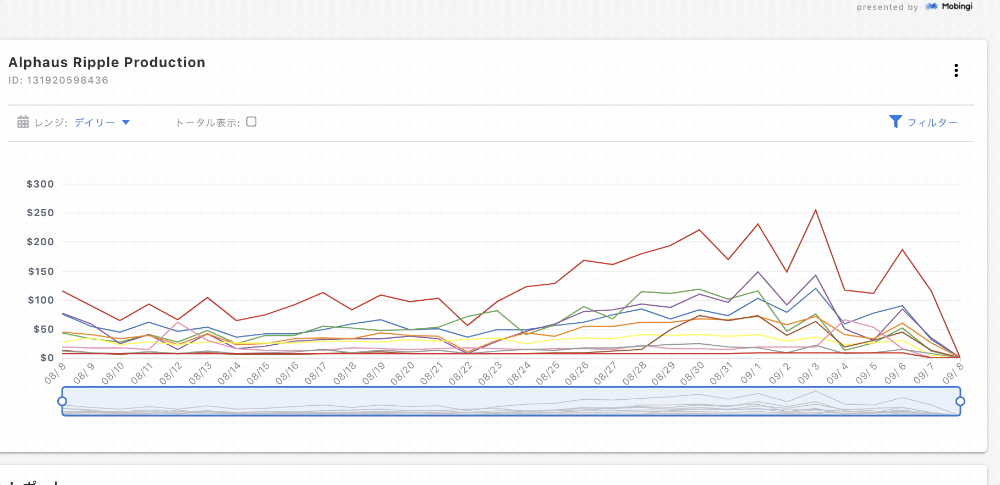

# 予算・通知設定

メニューのレポート &gt; 各アカウントの右上のドロップダウンから予算設定をクリックし、予算と通知の設定が可能です。

**AWSからのデータ更新のタイミングに依存するため、リアルタイムではなく、平均して1-2日前のデータを元に予算超過を確認します。**

各アカウントに対して、それぞれ以下項目1つずつの設定となります。

設定できる項目

| 通知先の設定 | 説明 |
| :--- | :--- |
| メールアドレス | 予算を超過した場合メールで通知が飛びます |
| Slack | Webhook URLを指定していただくことによりSlackに通知が 飛びます |

<table>
  <thead>
    <tr>
      <th style="text-align:left">&#x4E88;&#x7B97;&#x306E;&#x8A2D;&#x5B9A;</th>
      <th style="text-align:left">&#x8AAC;&#x660E;</th>
    </tr>
  </thead>
  <tbody>
    <tr>
      <td style="text-align:left">&#x65E5;&#x3054;&#x3068;&#x306E;&#x8A2D;&#x5B9A;</td>
      <td style="text-align:left">1&#x65E5;&#x3042;&#x305F;&#x308A;&#x306E;&#x4E88;&#x7B97;&#x3092;&#x30C9;&#x30EB;&#x30D9;&#x30FC;&#x30B9;&#x3067;&#x306E;&#x56FA;&#x5B9A;&#x984D;&#x3001;&#x307E;&#x305F;&#x306F;&#x524D;&#x65E5;&#x6BD4;&#x306E;
         &#x5272;&#x5408;&#x3067;&#x6307;&#x5B9A;&#x3067;&#x304D;&#x307E;&#x3059;&#x3002;</td>
    </tr>
    <tr>
      <td style="text-align:left">&#x6708;&#x3054;&#x3068;&#x306E;&#x8A2D;&#x5B9A;</td>
      <td style="text-align:left">
        
&#x6708;&#x5358;&#x4F4D;&#x3067;&#x306E;&#x4E88;&#x7B97;&#x306E;&#x8A2D;&#x5B9A;&#x304C;&#x53EF;&#x80FD;&#x3067;&#x3059;&#x3002;

        
&#x6BCE;&#x6708;1&#x65E5;&#x304B;&#x3089;&#x672B;&#x65E5;&#x307E;&#x3067;&#x3092;&#x5BFE;&#x8C61;&#x3068;&#x3057;&#x3001;&#x6708;&#x304C;&#x5207;&#x308A;&#x66FF;&#x308F;&#x308B;&#x3068;&#x5229;&#x7528;&#x6599;
           &#x306F;&#x30BC;&#x30ED;&#x3068;&#x3057;&#x3066;&#x30AB;&#x30A6;&#x30F3;&#x30C8;&#x3055;&#x308C;&#x307E;&#x3059;&#x3002;

      </td>
    </tr>
  </tbody>
</table>

