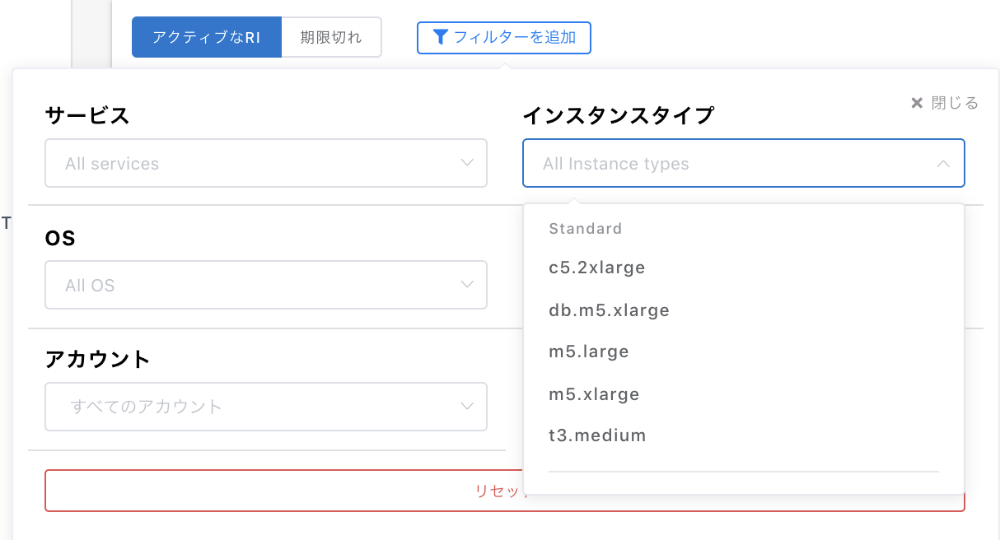

# 各種設定・変更

コンソール右上のドロップダウンメニューから設定を選択します。

### 設定画面でできること

1. 環境設定
   * 言語設定：日本語、英語に対応しています。 
2. アカウント設定

   * パスワードの変更 現在のパスワードを入力することにより新しいパスワードを指定できます。現在のパスワードを忘れてしまった場合はお手数ですが、[ログインページより再設定](https://app.alphaus.cloud/wave/login)をお願いいたします。

3. ユーザーの管理

   * ユーザー管理画面に遷移します。サブユーザーの作成や権限の振り分けが可能です。

4. セキュリティ

   * 2段階認証を有効化できます。

5. APIアクセストークン
   * API利用時のアクセストークンが作成できます。 
6. IdP設定
   * SAML認証を使用したシングルサインオンの設定が可能です。

## 設定：レポートページ

### 予算通知設定

レポートページから設定・変更できる作業です。

レポートページから対象のアカウントを選択し、右上メニューの`予算設定`ボタンをクリック。

下記項目をアクティブにし設定した上で`設定を保存`ボタンを押してください。

* 通知先の設定 
  * メールアドレス
  * Slack 
* 日毎の設定
  * 1日の予算（ドル）
  * 前日比（パーセント）
* 月毎の予算
  * １ヶ月の予算（ドル）

2日前までのデータを元に、予算をオーバーしたタイミングで指定した先に通知されます。  
メールで設定した場合は下記のようなメールが届きます。

### アカウント名の変更

アカウント名右の`Edit`をクリックするとWave上の名前の表記が変更できます。

## パスワードの再設定 

パスワードを忘れた際にログインページからのリンクで再設定できます。

1. `パスワードの再設定`をクリック
2. メールアドレスを入力
3. メールに通知された6桁の番号を入力して認証
4. パスワードを再設定

