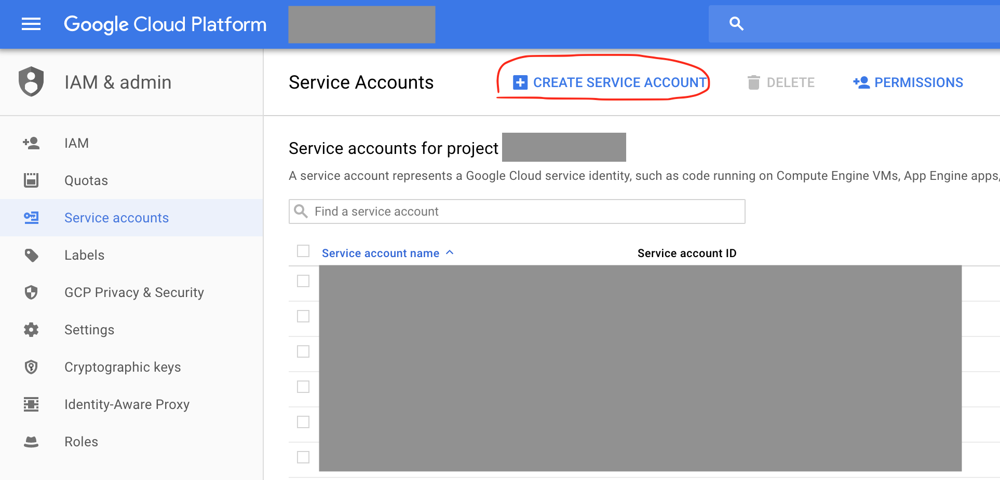

# Adding GCP account

We recommend you to use service accounts as GCP credentials to ALM. To create a service account, please follow the steps below:

Go to "Service accounts" menu under "IAM & admin" section of Google Cloud Platform's main menu. Click "CREATE SERVICE ACCOUNT" button.

Give it a name and make sure the following permissions are added:

* Editor
* Deployment Manager Editor

Make sure to check "Furnish a new private key" with JSON as option. You will be prompted to download and save the file. Save it to a safe location.

