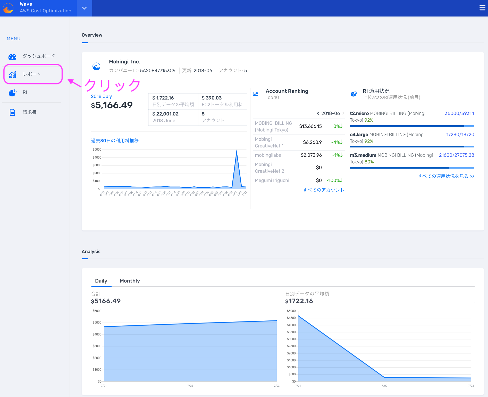

# 明細の確認方法

## Mobingi Waveで明細を確認する 

* メニューの`レポート`をクリックします。

* レポートでは、個別のアカウントの利用状況が確認できます。複数のAWSアカウントを組織内で利用している場合、画面左側に全てのアカウントがリストアップされます。明細を確認したいアカウントを選択します。画面を下にスクロールし、明細を表示します。

* 明細は月別、サービス別に確認できます。明細を確認したい年月とAWSのサービスを選ぶことで、該当する明細が表示されます。

## 請求書の確認、ダウンロード 

* 画面左側のメニューの請求書を選択すると、請求データが表示されます。発行済の請求書を確認することができます（年月を指定）。ダウンロード・ボタンからPDFファイルとして請求書をダウンロードできます。

## 一時金の確認 

Reserved Instanceの前払い金や返金、AWSから付与されたクレジットなど、通常の請求に載らない一時金が確認できます。

これらの一時金は毎月7日頃に確定します。

メニューからレポート、閲覧したいアカウントを選択します。画面右上の歯車マーク &gt;&gt; `Extra Information`をクリックすると月ごとの一時金が閲覧できます。

一時金には下記のようなものを含みます。

* Reserved Instance の前払い料金
* 返金（マイナス表記）
* クレジット（マイナス表記）
* サポート料金　
* その他一時金

