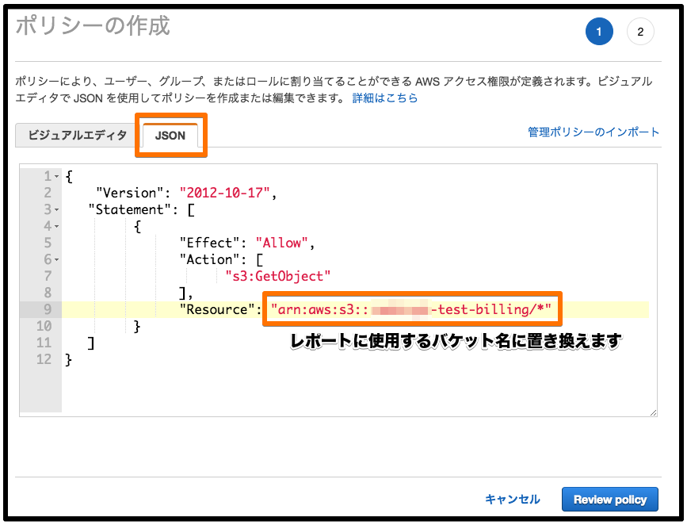

# 事前準備

* モビンギのデイリーレポート解析を有効にするために、お客様のAWSアカウントで実施する必要がある作業と、モビンギに提出する情報について記述します。
* 作業後、モビンギに提出する情報については以下の通りです。 各段階の作業で控えていただくようお願いいたします。\(作業後でも確認可能です。\)

```text
- AWSアカウントのID (数字12桁)

- 作成したレポートの情報

    - レポート名

    - S3バケット

    - レポートパスのプレフィックス、またはレポートのパス

- 特定バケット許可用の IAMロールのARN (例: arn:aws:iam::xxxxxxxxxxxx:role/crossacounnt-access-for-mobingi)
```

## 手順 1 : S3バケットおよびデイリーレポートの作成\(任意\) {#step1}

* 請求情報を共有するAWSのアカウントで、デイリーレポートを作成します。
* 以下の条件に当てはまるレポート定義がすでにある場合、この作業をスキップしてすることが可能です。

  `時間単位: 日別`

  `レポートに含める項目で リソースID が有効`

  `バケット内にモビンギが 閲覧してはいけないオブジェクト を含まない(バケット全体に読み取りアクセスを付与するため)`

### 手順1-1: **S3バケットの作成**

* S3コンソールから任意の名称でバケットを作成します。オプションはデフォルトで構いません。

  レポートの出力先として利用するため、バケット名を控えておいてください。

### 手順1-2: **デイリーレポートの作成**

* AWSのマネジメントコンソールから、『請求情報とコスト管理ダッシュボード』を開き、レポートメニューへ移動します。

レポートの作成へ進みます。


* 『ステップ 1: 明細項目の選択』を、以下の要領で記入して次に進めます。
  * レポート名: 任意
  * 時間単位: **日別**
  * 含める: **リソースID** にチェック
  * サポートの有効化: 任意


* 『ステップ 2: 配信オプションの選択』では、S3バケットの操作を含めるため、以下手順で進めます。
  * S3バケット名\(先程作成\)を入力
  * サンプルポリシーの表示とコピー \(※必ずS3バケット名を入力後に表示してください\)


* サンプルポリシーをコピーした後、**先程作成したS3バケット** の詳細を開きます。\(※別タブまたはウィンドウでの作業を推奨\)
* S3で『アクセス権限』&gt;&gt; 『バケットポリシー』とメニューをたどります。
* バケットポリシーエディタで、先程のサンプルポリシーを適用します。


『ステップ 2: 配信オプションの選択』に戻り、以下の項目を入力して次へ進みます。

* レポートパスのプレフィックス: 任意 \(※なしでも構いません\)
* 圧縮: 任意

バケットポリシーが正しくない場合、検証で「有効なバケット」となりません。

S3のメニューで再度確認してください。


『ステップ 3: 確認』表示されている内容に間違いがない確認し、完了します。


## 手順 2 :モビンギに読み取り権限を委譲するIAMロールの作成 {#step2}

AWSのマネジメントコンソールから、IAMサービスを開き、『ロール』&gt;&gt; 『ロールの作成』メニューへ移動します。


『信頼されたエンティティの種類を選択』で、「別のAWSアカウントを」選択し、以下のモビンギのアカウントIDを入力します。

* モビンギアカウントID: 131920598436


「アクセス権限ポリシーをアタッチする」メニューで、『ポリシーの作成』を選択します。


別のタブ\(ウィンドウ\)で「ポリシーの作成」メニューが開くので、入力形式にJSONを選択し、以下の内容でポリシーを入力します。 Resourceの`{replace_to_report_bucket}`部分を **レポートに使用するバケット名** に置き換えてください。

```bash
{
    "Version": "2012-10-17",
   "Statement": [
         {
               "Effect": "Allow",
               "Action": [
                     "s3:GetObject"
               ],
               "Resource": "arn:aws:s3:::{replace_to_report_bucket}/*"
         }
   ]
}
```


「ポリシーの確認」へ進み、以下の項目を入力してポリシーを作成します。

* 名前: 任意\(※必須\)
* 説明: 任意



『ロールの作成』メニューに戻り、リストを更新し、先ほど作成したポリシーを表示します。 チェックを有効にして、確認へ進みます。


「確認」メニューで、以下の項目を入力します。

* ロール名: 任意\(※必須\)
* ロールの説明: 任意

「信頼されたエンティティ」、「ポリシー」が適用されていることを確認し、ロールを作成します。


作成したロールのARNを控えます。


