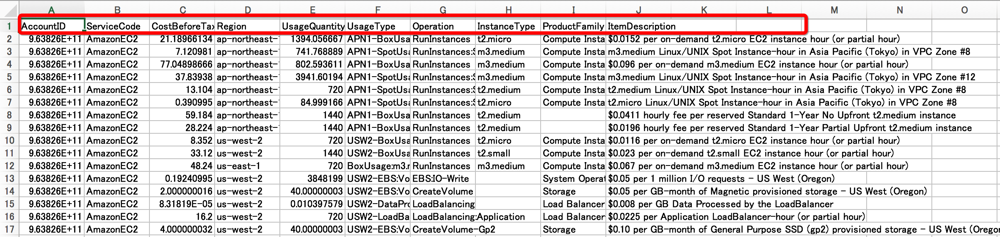

# 报告和CSV的看法

* 在此页面对照控制面板的报告和已下载的CSV，讲解各项目。

  在报告和CSV有同意词但不一样的单词和缩写的项目。

  下图中用相同颜色包围的部分是相同的项目。

1. AccountID: AWS的帐户ID
   * 由于报告以每个帐户为单位表示/下载，因此每个CSV仅显示一个ID。
2. ServiceCode: AWS的每个服务名称
   * Elastic Cpmpute Cloud等，然而，在CSV中， `Elastic Compute Cloud` 为 `AmazonEC2` ，`Simple Storage Service` 为 `AmazonS3`等以缩写表示。
3. CostBeforeTax: 不含税的每月利用额
   * 报告中小数显示到小数第2位。 比如在此列报告中的 `$21.18` 和在CSV中的 `21.18966134` 是一致的。
4. Region: 地区
   * 在此例中，在控制面板显示为 `Asia Pacific(Tokyo)` ，而在CSV中则显示为`ap-northeast-1` 。 两者都是指东京地区。
5. UsageQuantity: 利用量
   * 此例在报告中是`1,394.05` 和在CSV中的 `1,394.056667` 是一致的。
6. InstanceType: 实例类型
   * 此例在报告和CSV都是 `t2.micro`，是一致的。
7. ItemDescription: 详细
   * 在此例中，报告和CSV都是`$0.0152 per on-demand t2.micro EC2 instance hour (or partial hour)` ，是一致的。

