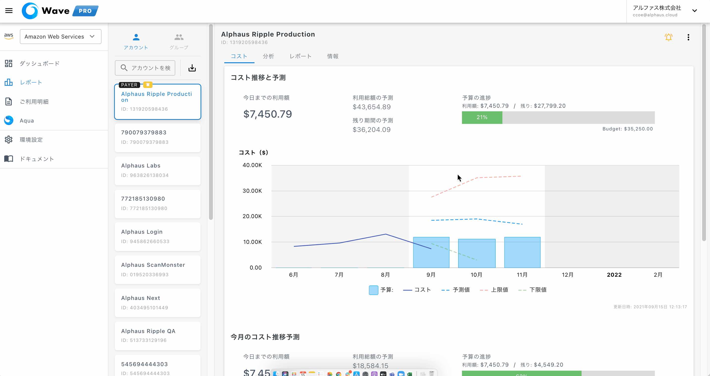
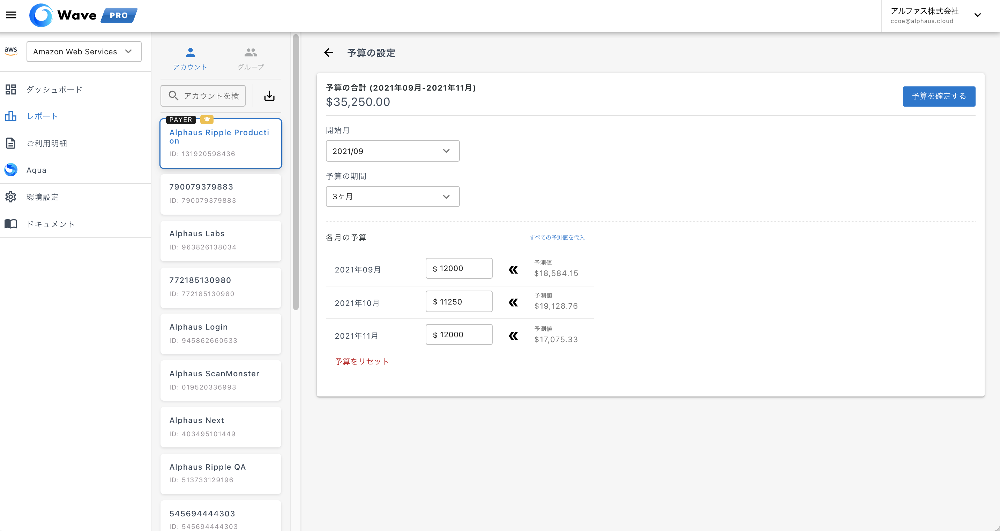
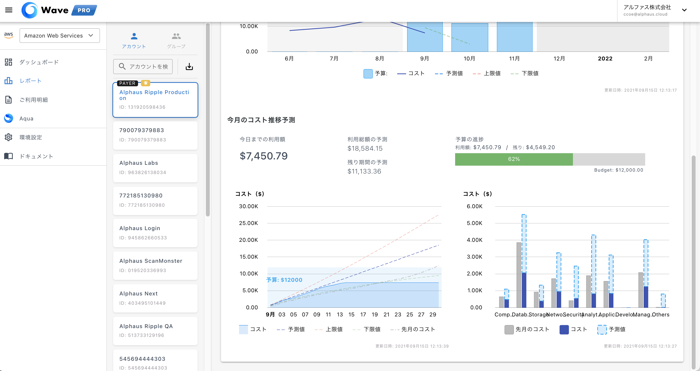

# 予算管理と予測

**機能概要**

Wave Proで予算の管理と予測の表示機能が実装され、AWSアカウント単位で予算を設定し実績値と照らし合わせてコストのモニタリングができるようになりました。

コスト推移と予測：  
３，６、１２ヶ月単位で予算を設定することができ、設定時には過去の利用推移をもとに予測を表示し、それをもとに予算設定も可能です。

設定された予算は実績値と合わせて見ることで予算超過の事前検知ができます。

今月のコスト推移予測：  
このセクションでは、今月の予測と実績値をより細かい粒度で表示します。

