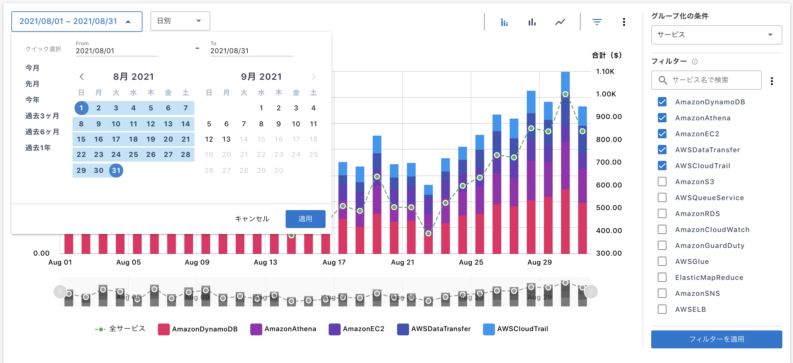

# ダッシュボード

ログインするとまずダッシュボード画面が表示されます。

### 1. お知らせ

ページ上部にはMSPからの通知やお知らせ内容が記載されています。  
記載が多い場合は右側の「もっと見る」ボタンから全体を閲覧することができます。

### 2. グラフ

ダッシュボードのグラフは WavePRO に含まれている全AWSアカウントの合計値です。

期間: カレンダーから指定可能  
グループ化の条件: サービス、アカウントの切り替えが可能  
\* タグベースの請求グループを含む場合はグループ化の条件でタグの選択が可能  

レンジで選択した粒度をベースにカテゴリーの選択に応じてサービス単位、アカウント単位での利用料金が閲覧できます。  
  

